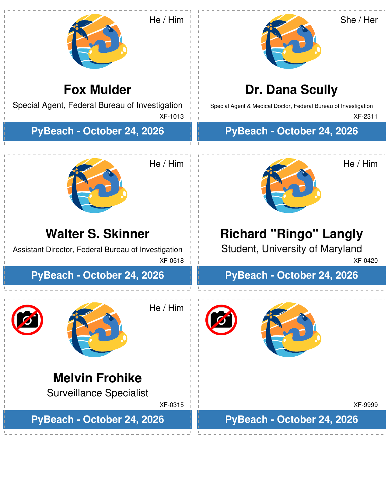

# PyBeach Badge Creator

Printable PDF attendee badge generator for [PyBeach](https://pybeach.org/).

Badges are formatted for standard **Letter (8.5" × 11")** sheets with 6 badges per page (2 columns, 3 rows). Each badge measures **4" × 2.875"** and includes attendee details, affiliation/school, pronouns, photo opt-out indicators, Tito order reference, conference logo, and a customizable bottom ribbon.



---

## Requirements & Setup

* [`uv`](https://docs.astral.sh/uv/)


### Environment Setup

You can sync the virtual environment directly:

```bash
uv sync
```

---

## Quickstart

Run badge generation with the bundled sample data:

```bash
# Reads `sample_attendees.csv` -> `badges.pdf`
uv run python createpdfs.py
```

---

## Command-Line Options

```
usage: createpdfs.py [-h] [-i INPUT_FLAG] [-o OUTPUT]
                     [--event-name EVENT_NAME] [--logo LOGO]
                     [--photo-opt-out-icon PHOTO_OPT_OUT_ICON]
                     [--guides | --no-guides] [--ribbon-color RIBBON_COLOR]
                     [csv_file]
```

See `uv run python createpdfs.py -h` for full details.

### Usage Examples

**Generate badges with custom Tito export:**
```bash
uv run python createpdfs.py attendees_2026.csv -o pybeach_2026_badges.pdf
```

**Custom event title and conference date:**
```bash
uv run python createpdfs.py attendees_2026.csv --event-name "PyBeach - October 24, 2026"
```

**Generate badges for pre-perforated / pre-cut paper (no cut guides):**
```bash
uv run python createpdfs.py attendees_2026.csv --no-guides
```

**Change ribbon branding color:**
```bash
uv run python createpdfs.py attendees_2026.csv --ribbon-color "#1E4E79"
```

---

## Input CSV Format (Tito Export)

The script directly parses [CSV exports](https://help.tito.io/en/articles/6811906-custom-exports) from **Tito**, the ticket processor used for PyBeach. A sample template is provided in `sample_attendees.csv`.

### Expected Columns

| Column Header | Type | Description / Behavior |
|---|---|---|
| `What name would you like printed on your badge?` | Required | Name displayed prominently on badge. If the value begins with `*` (e.g. `*`), a blank badge is produced (ideal for walk-in attendees to handwrite their names). |
| `Ticket` | Required | Ticket tier name (e.g. `Corporate`, `Early Bird Corporate`, `Individual`, `Student`, `Early Bird Student`). Rows with ticket `Donate to PyBeach` are automatically excluded. |
| `Photo opt-out` | Required | If set to `Opt-out`, a no-photos camera icon is rendered in the top-left corner. Rows with empty values are skipped. |
| `Would you like your pronouns printed on your badge?` | Optional | If value starts with `Yes`, the attendee's pronouns are printed in the top-right corner. |
| `Pronouns` | Optional | Attendee pronouns (e.g. `She / Her`, `He / Him`, `They / Them`). Auto-formatted and capitalized. |
| `Ticket Job Title` | Optional | Attendee job title. Formatted with company or as standalone affiliation. |
| `Ticket Company Name` | Optional | Printed on corporate ticket badges (e.g. `Principal Engineer, Acme Corp`). |
| `What school do you attend?` | Optional | Printed on student ticket badges (e.g. `Student, UC San Diego`). |
| `Order Reference` | Optional | Tito order reference (e.g. `PB26-A101`), printed in 10 pt font in the lower-right area just above the ribbon. |

### Special Features

1. **Automatic Font Scaling**: Names and affiliations that exceed the badge width automatically step down in font size to prevent overlapping or truncation.
2. **Blank / Walk-in Badges**: Set the name to `*` to generate badges without a name while still including the logo, date ribbon, and cutting guides.
3. **Optimized SVG Rendering**: Vector SVG assets are cached and pre-scaled in memory, allowing large attendee lists to render quickly.
